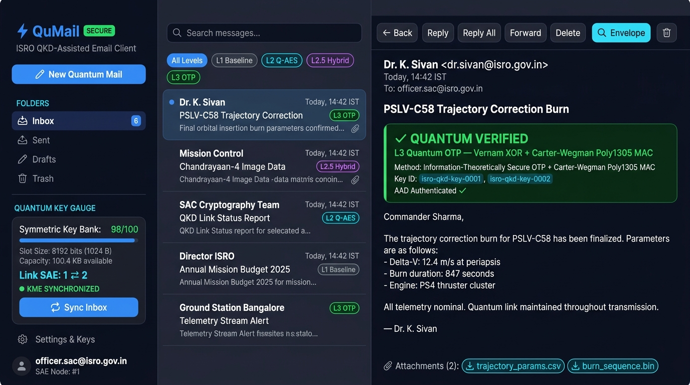

# QuMail

QuMail is a quantum-safe email client built for ISRO Smart India Hackathon 2025 (Problem Statement SIH1523). It lets you send and receive email using layered post-quantum encryption on top of standard SMTP and IMAP, so messages stay confidential even against a future quantum computer.

It ships as a desktop GUI application and a command-line tool, both written in Rust.



---

## Why this exists

Standard email encryption (S/MIME, PGP) relies on RSA and elliptic-curve key exchange. A sufficiently large quantum computer running Shor's algorithm can break those in hours. Adversaries are already capturing encrypted traffic today to decrypt later once quantum hardware matures. This is known as harvest-now-decrypt-later.

QuMail addresses this by replacing classical key exchange with two independent quantum-resistant mechanisms:

- A local symmetric key bank pre-shared over a QKD (Quantum Key Distribution) link, conforming to ETSI GS QKD 014
- NIST FIPS 203 ML-KEM-768 (lattice-based key encapsulation), which has no known quantum attack

Both are combined through a dual-PRF so that breaking either one alone is not enough to read the message.

---

## Security levels

You choose how much protection each message gets:

| Level | Name | What protects the message |
|-------|------|--------------------------|
| L1 | Baseline | TLS transport only, no payload encryption |
| L2 | Q-AES | AES-256-GCM with a key derived from QKD material |
| L2.5 | Hybrid PQC | QKD key combined with ML-KEM-768 via HKDF dual-PRF |
| L3 | Quantum OTP | Vernam one-time pad with Carter-Wegman Poly1305 authentication |

L3 is information-theoretically secure, meaning it cannot be broken regardless of computing power.

---

## Project structure

This is a Cargo workspace. Each crate has a single responsibility and can be tested independently.

```
crates/
  qumail-core     Domain types: SecurityLevel, SaeId, KeyId, CryptoContext, error types
  qumail-kme      Key management: ISRO 100x1Kb key bank, ETSI QKD 014 client, QKD simulator
  qumail-crypto   Cryptography: all four security levels behind a single CryptoProvider trait
  qumail-net      Mail pipeline: MIME packaging, SMTP send, IMAP fetch, envelope parsing
  qumail-cli      Command-line tool (qumail binary)
  qumail-ui       Desktop GUI (qumail-gui binary, built with egui)

docs/
  architecture.md   System design and module responsibilities
  protocol.md       Wire format, envelope schema, cryptographic flows
  security.md       Threat model, attack resistance analysis, known limitations
```

---

## Building

You need Rust 1.78 or later.

On Fedora / RHEL you also need the OpenGL and Wayland development headers for the GUI:

```
sudo dnf install mesa-libGL-devel wayland-devel libxkbcommon-devel
```

On Ubuntu / Debian:

```
sudo apt install libgl1-mesa-dev libwayland-dev libxkbcommon-dev
```

Build everything:

```
cargo build
```

Build only the CLI (no GUI dependencies):

```
cargo build --bin qumail
```

Run all tests:

```
cargo test --workspace
```

---

## CLI usage

### Initialize a key bank

Creates a pair of symmetric key bank files. Alice keeps one, Bob keeps the other. They must be transferred to each machine through a secure channel, not over email.

```
cargo run --bin qumail -- init-keybank \
  --alice-file keybank_alice.json \
  --bob-file keybank_bob.json
```

### Check key inventory

```
cargo run --bin qumail -- kme-status \
  --key-bank keybank_alice.json \
  --my-sae 1 \
  --peer-sae 2
```

### Generate an ML-KEM-768 keypair

```
cargo run --bin qumail -- generate-pqc-key --out pqc_keypair.json
```

Share the `public_key_b64` field from this file with anyone who will send you encrypted mail. Keep the file itself private.

### Send an email

```
cargo run --bin qumail -- send \
  --from you@example.com \
  --to recipient@example.com \
  --subject "Mission briefing" \
  --text "Body text here" \
  --security hybrid \
  --key-bank keybank_alice.json \
  --recipient-pqc-key pqc_keypair.json \
  --smtp-host smtp.gmail.com \
  --smtp-port 587 \
  --username you@example.com \
  --password YOUR_APP_PASSWORD
```

Security options are: `baseline`, `qaes`, `hybrid`, `quantum-otp`.

Add `--dry-run` to encrypt and display the envelope without actually sending.

### Fetch and decrypt incoming mail

```
cargo run --bin qumail -- fetch \
  --imap-host imap.gmail.com \
  --imap-port 993 \
  --username you@example.com \
  --password YOUR_APP_PASSWORD \
  --key-bank keybank_bob.json \
  --pqc-key pqc_keypair.json
```

---

## Desktop GUI

```
cargo run --bin qumail-gui
```

The GUI is a three-pane layout similar to Outlook. The left panel shows your folder list and a live key bank gauge. The middle panel lists messages with per-message security badges. The right panel shows the decrypted message and a verification banner showing which algorithms protected it.

From the GUI you can compose messages with real-time key consumption estimates, sync your inbox over IMAP, and open a cryptographic inspector that shows the raw envelope header, nonces, key IDs, and ML-KEM ciphertext for any received message.

Configure your SMTP and IMAP credentials and key paths under Settings.

---

## Gmail setup

Gmail does not accept regular passwords from third-party apps. You need an App Password:

1. Enable two-step verification on your Google account
2. Go to myaccount.google.com/apppasswords
3. Generate a password for QuMail
4. Use that 16-character password (without spaces) in the password fields

---

## How the encryption works

When you send a message at L2.5 (Hybrid PQC), QuMail:

1. Reserves a key slot from the local key bank and reads the 1024-byte quantum key
2. Runs ML-KEM-768 encapsulation using the recipient's public key to produce a second shared secret
3. Combines both secrets: `K = HKDF-SHA256(salt=message_id, ikm=qkd_key || pqc_secret)`
4. Encrypts the full inner MIME message (including attachments) with AES-256-GCM using K
5. Packages the ciphertext and a JSON envelope header into a `multipart/encrypted` MIME message
6. Sends it through normal SMTP

The envelope header contains the key slot ID, a 12-byte nonce, and the ML-KEM ciphertext. It does not contain any key material. A recipient without both the matching key bank and the ML-KEM private key cannot decrypt.

Recipients running QuMail fetch the message over IMAP, detect the envelope, recover the key slot from their own key bank, run ML-KEM decapsulation, and reproduce K to decrypt.

Recipients using a standard email client (Gmail, Outlook) see two attachment files instead of a readable message.

---

## Test results

```
qumail-core    2 tests passed
qumail-crypto  9 tests passed
qumail-kme     6 tests passed
qumail-net     11 tests passed (1 unit + 10 interoperability and fault-injection)
qumail-cli     3 end-to-end integration tests passed

Total: 31 tests, 0 failures
```

---

## Crate versions

| Crate | Purpose | Version |
|-------|---------|---------|
| ml-kem | NIST FIPS 203 ML-KEM-768 | 0.3 |
| aes-gcm | AES-256-GCM encryption | 0.10 |
| hkdf | HKDF-SHA256 key derivation | 0.12 |
| lettre | SMTP client | 0.11 |
| async-imap | IMAP client | 0.9 |
| egui / eframe | Desktop GUI | 0.28 |
| clap | CLI argument parsing | 4 |
| tokio | Async runtime | 1.38 |

---

## Docs

- [Architecture](docs/architecture.md)
- [Protocol specification](docs/protocol.md)
- [Security analysis](docs/security.md)

---

## License

MIT or Apache-2.0, at your option.
